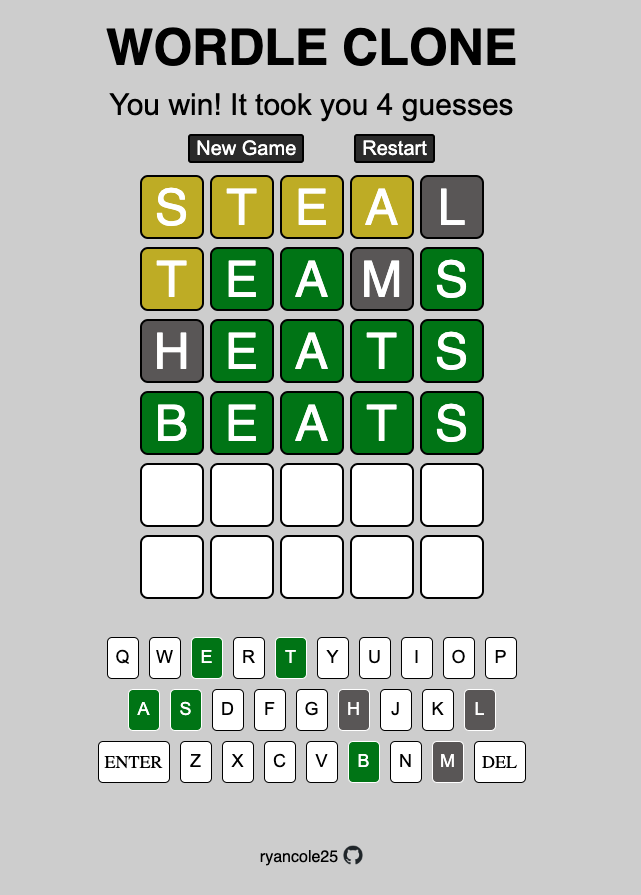

# WordleClone
This is a clone of the New York Times hit game, "Wordle". I made this project using HTML, CSS, and JavaScript from scratch (other than a lot of inspiration from the actual Wordle game). 

This project helped me to have a better grasp on incorporating logic (the game rules) and manipulating stylistic elements on the page simultaneously. The code for this is absolutely not optimized and if I were to remake this project, I would have approached coding the game logic a little differently and perhaps more elegantly. 

Overall I succeeded in my goal to make a decent looking and functional clone of an existing game

Here is a screenshot of the site:
